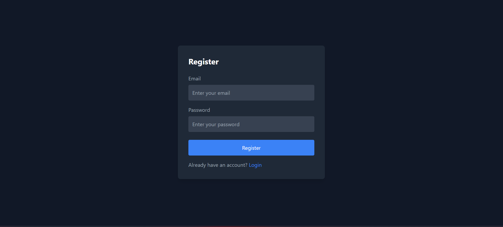
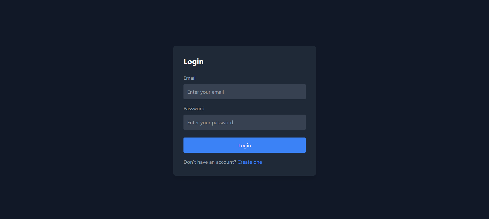
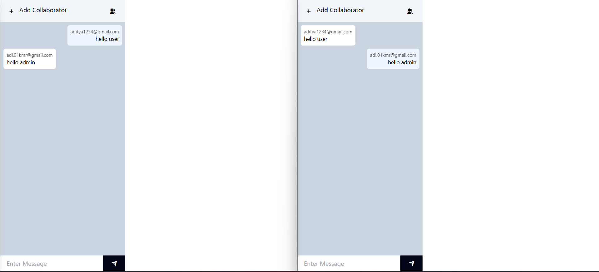
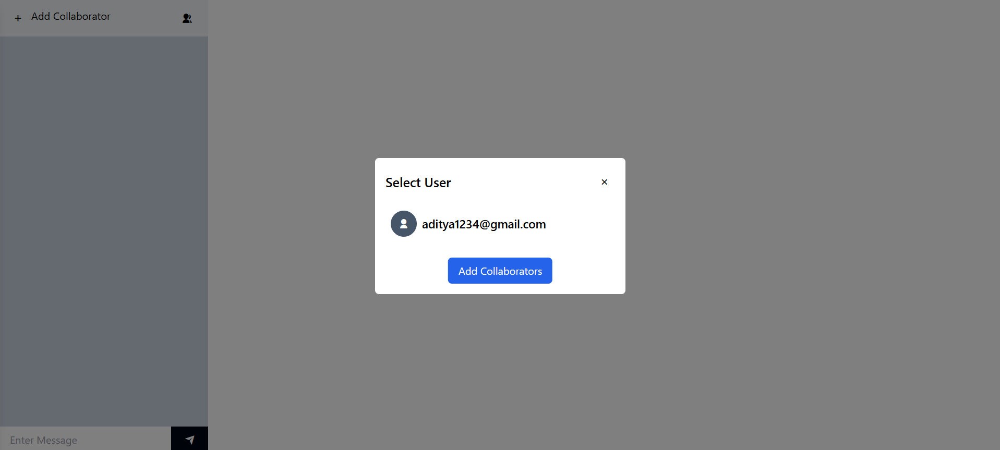

# 💬 ChatApp

A real-time chat application built with the MERN stack (MongoDB, Express, React, Node.js) and powered by Socket.IO for seamless, instant messaging.

## 🚀 Features

- 🔐 User Authentication (Sign Up / Login)
- 💬 Real-Time Messaging with Socket.IO
- 🧑‍🤝‍🧑 One-on-One Chat
- 🌐 Online Users Indicator
- ✨ Responsive UI using Tailwind CSS
- 🧾 Message history stored in MongoDB

## 🛠️ Tech Stack

**Frontend**:
- React.js
- Tailwind CSS
- Axios
- Socket.IO Client

**Backend**:
- Node.js
- Express.js
- MongoDB & Mongoose
- Socket.IO
- JSON Web Token (JWT)
- bcrypt.js

## 📦 Installation

### 🔧 Prerequisites

- Node.js
- MongoDB (local or MongoDB Atlas)
- npm 

## 🖼️ Screenshots

### 🔐 Register Page

### 🔐 Login Page

### 🔐 LiveChat Page

### 🔐 AddCollaborator Page

